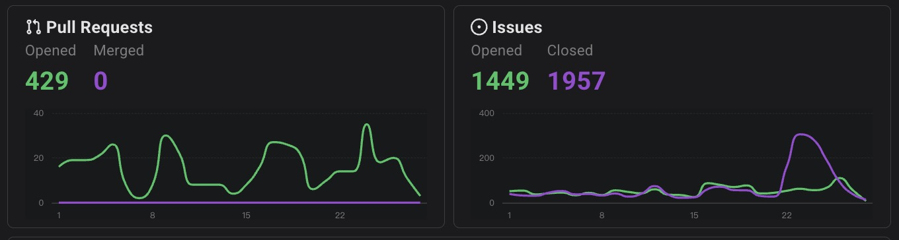

# 数据说明

在本目录中，可以通过 [meta_data.json](meta_data.json) 查阅涉及到的所有元数据字段的统计口径，以及一位代表性开发者 afc163 的数据样例展示。每位拥有报告的开发者的数据都以一份 json 文件的形式上传至 oss，并提供开放接口：

- 报告的数据根地址为： https://oss.open-digger.cn/antgroup/oss_dev_report_2025/
- 本次所有拥有报告的开发者名单：https://oss.open-digger.cn/antgroup/oss_dev_report_2025/_logins.json
- 开发者数据地址： https://oss.open-digger.cn/antgroup/oss_dev_report_2025/{login}.json ，其中 login 需替换为真实用户登录名 toLower 后的名称。
- 开发者单项数据格式及说明（同 meta_data 文件）： https://oss.open-digger.cn/antgroup/oss_dev_report_2025/_meta_data.json ，该文件中 fields 字段中列出了所有字段的名称、类型、说明，字段顺序为在报告页面中数据的出现顺序。

## 哪些人会拥有报告？

本次报告的生成范围为 2025 年在蚂蚁的开源项目中贡献度不为 0 的社区开发者（以及所有收录了 GitHub Login 的蚂蚁员工）。贡献度基于 Issue/PR 协作来计算。具体包括以下情况：
- 在蚂蚁开源项目的 Issue/PR 中参与了评论；
- 在蚂蚁开源项目中开启了 Issue/PR，且该 Issue/PR 后续有其他开发者的共同参与；
- 在蚂蚁开源项目中进行了 PR 的评审，或者开启的 PR 被合入。

## 贡献度和段位的统计方法？

本次报告的贡献度来自于开发者 2025 年在 GitHub 全域上的 OpenRank 值，段位根据 OpenRank 排名，按照 50%, 12%, 8%,  5%, 3% 和 1% 的比例划分为六个档位。

[OpenRank](https://open-digger.cn/docs/user_docs/metrics/community_openrank) 统计算法，是一种基于 Issue 与 PR 协作的图模型算法。算法的设计原理和 PageRank 类似，开发者在影响力更高的仓库中贡献，在仓库中拥有更高的贡献比例，以及与影响力更高的开发者产生协作关联，都能使其贡献度（OpenRank 值）有效提升。

更多细节也可阅读 ICSE 2024 收录论文：https://dl.acm.org/doi/10.1145/3639477.3639734

## 可能存在的数据缺失

1. 报告数据来自于 GitHub Events API，只收录 Public 状态下的仓库日志事件，在仓库 Private 状态下的活跃行为无法计入报告的数据统计中。

2. GitHub Events API 一直存在随机概率的数据缺失，但比例较小。在今年，GitHub 对 API 进行了[升级](https://github.blog/changelog/2025-08-08-upcoming-changes-to-github-events-api-payloads/)，减少了 payload 中的一部分字段信息。升级后，数据开始出现严重的缺失：10 月份有整整一周的日志数据全部丢失（10/08-14），且 10/08 以来的所有 PR 合入事件也都丢失。也就是说，通过 Events API，10/08 以来全域查不到一个 PR 的合入，对应的也查不到 PR 中的代码变更行数。

这一数据故障影响了很多依赖于 Events API 的下游应用，例如，[OSSInsight](https://ossinsight.io) 洞察看板显示，VSCode 项目近 28 天内没有一个 PR 合入，而这显然和事实不符。
 

有关数据缺失问题的描述和讨论，还可参考：
- https://github.com/orgs/community/discussions/178788
- https://github.com/orgs/community/discussions/181678

3. 我们已经为蚂蚁的大部分开源项目安装了 [OpenDigger Data App](https://github.com/apps/open-digger-data-app)，用于从 GitHub GraphQL API 采集和回溯缺失的数据，但是在非蚂蚁且没有安装 App 的仓库中进行的贡献，仍然有很大概率会被遗漏。如果你是某个项目的 Owner，建议安装 App 以获得更准确的项目贡献度统计情况。

## 关键词页

关键词基于今年开发者在 Issue 和 PR 中产生的文本信息，由大模型提取。由于大模型生成之后需要人工校准一遍，本次报告仅为最强王者、永恒钻石两个段位的社区开发者制作了关键词页。